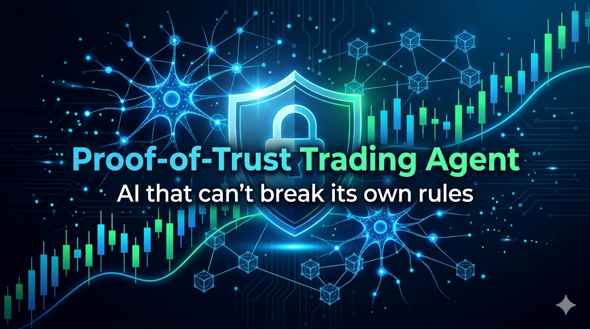

# Proof-of-Trust Trading Agent



> An AI trading agent that cannot break its own rules — and proves it on-chain.

**[AI Trading Agents Hackathon](https://lablab.ai/ai-hackathons/ai-trading-agents)** — March 30 – April 12, 2026 | Kraken Challenge + ERC-8004 Challenge

**[GitHub Repository](https://github.com/zixelfreelance/erc8004-trading-agent)**

---

## Vision

AI agents in finance today are black boxes. You can't verify what they do, why they do it, or whether they'll blow up your capital.

We're building the **safety layer for autonomous financial agents**, demonstrated through a live trading agent on Kraken.

**Core principle:** AI is untrusted input. The agent proposes — the system decides.

## Trust Triangle

Every agent must satisfy all three simultaneously:

- **Identity** (ERC-8004) — who acts
- **Constraints** (Risk Router) — what is allowed
- **Auditability** (Validation Artifacts) — what happened

## Proof of Decision

Every trade produces a verifiable artifact: inputs, reasoning, signed intent, risk validation result, and execution outcome. This is not logging — it's a cryptographic audit trail.

## Architecture

```
ERC-8004 Identity Registry
        |
  AI Strategy Engine (Momentum + Claude/ADK Hybrid)
        |
  Intent Builder + Signer (EIP-712)
        |
  Risk Gates (drawdown, position, confidence, circuit breaker)
        |
  Execution (Kraken CLI — paper or live)
        |
  Validation & Reputation (artifact hash -> on-chain)
        |
  Dashboard (SvelteKit) + HTTP API
```

**Hexagonal architecture:** Ports define contracts. Adapters are swappable. Domain logic is pure.

## Quick Start

```bash
cargo build
cargo run                                    # paper mode (default)
AGENT_DEMO_MODE=true cargo run               # demo mode
AGENT_EXECUTION_MODE=live cargo run           # live mode
```

## Strategies

| Strategy | Description |
|---|---|
| **Momentum** | Deterministic signal based on price momentum with volatility band filtering |
| **ADK/Claude** | LLM-powered decisions via Anthropic ADK-Rust with 4 tool-augmented signals |
| **Hybrid** | Momentum signal as "strong prior" refined by Claude (recommended) |

## Risk Controls

7 non-overridable risk gates protect capital:

1. Max drawdown cap (5%)
2. Single position limit
3. Confidence floor (0.6)
4. Fee-aware filter (edge > 0.7%)
5. Regime filter (hold during transitions)
6. Circuit breaker (3 losses or $5 daily loss)
7. ATR trailing stop (1.5x ATR)

## Tech Stack

| Layer | Technology |
|---|---|
| Agent | Rust (hexagonal architecture, async tokio) |
| AI | Anthropic ADK-Rust (Claude Sonnet) |
| Execution | Kraken CLI (paper + live) |
| Signing | EIP-712 ECDSA (secp256k1) |
| On-chain | Solidity on Sepolia — Identity, Reputation, Risk Router |
| Dashboard | SvelteKit |